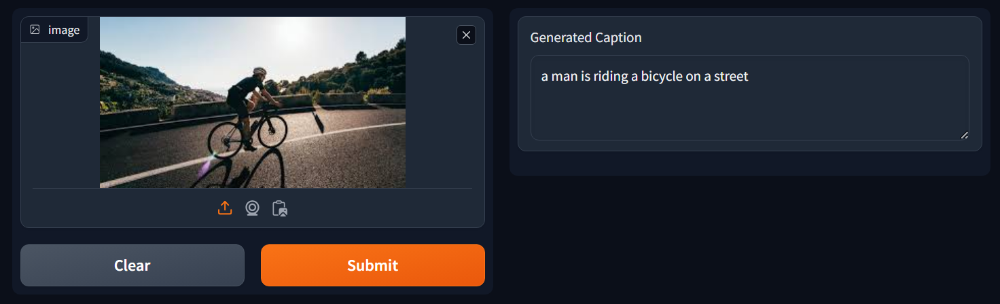

# SnapScript

<a href="https://huggingface.co/spaces/Saptarshi003/SnapScript"></a>



## Overview

A Image Captioning system capable of generating caption for single images.
 - Uses Transformer architecture.
 - Integrates EfficientNetB0 for image embeddings and employs a vocabulary size of 10,000.
 - Achieving 73% accuracy on the Flicker8k dataset
 - Deployed using Gradio

## Usage

1. Install all the packages

 ```python
 python3 -m pip install -r requirements.txt
 ```

 2. Run the Gradio app

 ```python
 gradio app.py
 ```